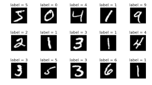

# ERA2 Session 5 PyTorch Assignment

## Table of Contents
1. [Introduction](#introduction)
2. [File Structure](#file-structure)
3. [Overview of the Dataset](#overview-of-the-dataset)
4. [Training and Test Accuracy](#training-and-test-accuracy)
5. [Plotting Loss and Accuracy](#plotting-loss-and-accuracy)
6. [Understanding the Code](#understanding-the-code)

## Introduction

This document serves as the readme file for the PyTorch Assignment of Session 5. The task entails restructuring code into distinct files and validating its functionality. Included is a PyTorch model designed for a specific machine learning objective, with auxiliary functions and primary code segregated into individual files.

## File Structure

- `model.py` : This file encompasses the PyTorch model for defining the convolution network.
- `utils.py` : This script contains utility functions for training, validation and prediction count functionalities.
- `S5.ipynb` : This Jupyter notebook serves as the central place for executing the machine learning task, utilizing both the model and utility functions..
- `README.md`: The README file you're currently reading. It offers a comprehensive explanation of the assignment and the provided code.

## Overview of the Dataset

In this assignment, the MNIST dataset is employed. It comprises images depicting handwritten digits, each sized 28x28 pixels. The dataset encompasses 60,000 training images and 10,000 testing images, with each image accompanied by a label indicating the represented digit, ranging from 0 to 9.

### Sample Images

The Conv Block 6 in S5.ipynb is used to showcase a selection of sample images extracted from the training dataset. This aids in visualizing the nature of the images that the model is being trained on. The displayed images are in grayscale and depict handwritten digits ranging from 0 to 9.

## Understanding the Code

The codebase is structured across multiple files to enhance organization and readability:

- `model.py` : - This file contains the definition of a neural network model architecture. It includes the implementation of the `Net` class, which defines the structure of the neural network.

- `utils.py` : This file contains utility functions that can be used for training a model. It includes functions for model summary, displaying loss and accuracies, displaying data samples, and training/testing the model.

- `S5.ipynb` :  Serving as the primary execution file, this Jupyter notebook begins by checking for CUDA availability and configuring the device accordingly. It proceeds to import utility functions, load data, and initialize the model along with its related functions. The model is then trained and evaluated using the provided data, with subsequent visualization of training and testing accuracy as well as loss plots.

## Training and Test Accuracy

The model achieves a training accuracy of approximately **99.16%** and a test accuracy of approximately **99.33%**. These values indicate that the model performs well on both the training data and unseen test data.

## Plotting Loss and Accuracy

The display_loss_and_accuracies function within utils.py is employed to generate plots illustrating the training and test losses along with accuracies. These visualizations offer insights into the evolution of the model's performance throughout the training process. The loss plots demonstrate the reduction in the model's error over time, while the accuracy plots showcase enhancements in the model's performance.

Thank you
